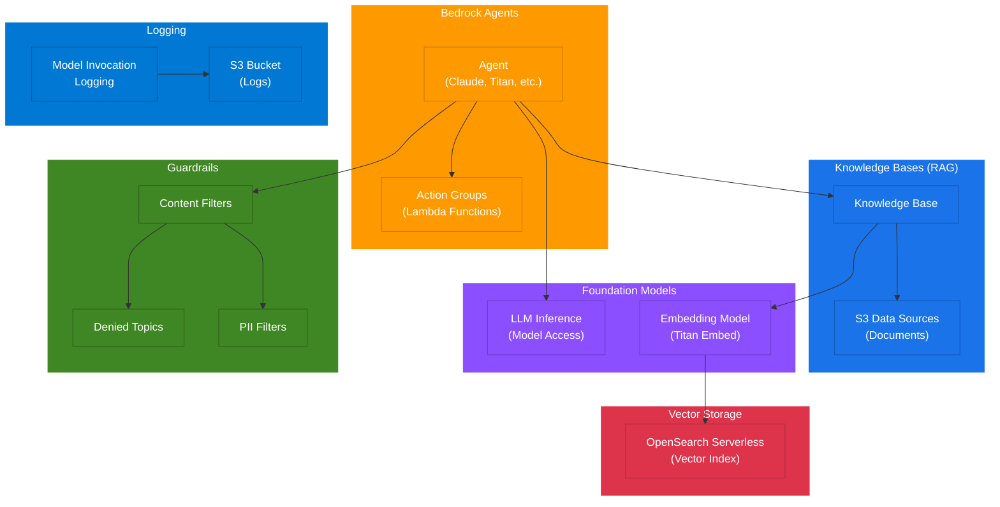

# terraform-aws-bedrock-platform

Terraform module for deploying a comprehensive Amazon Bedrock platform with Knowledge Bases, Agents, Guardrails, OpenSearch Serverless vector storage, and model invocation logging.

## Architecture

This module provisions a complete RAG (Retrieval-Augmented Generation) architecture on AWS:

```
                                    +---------------------------+
                                    |    Amazon Bedrock         |
                                    |    Model Invocation       |
                                    |    Logging                |
                                    +------------+--------------+
                                                 |
                                                 v
                                    +---------------------------+
                                    |    S3 Bucket (Logs)       |
                                    +---------------------------+

+-------------------+       +---------------------------+       +---------------------------+
|                   |       |                           |       |                           |
|   End Users /     +------>+   Bedrock Agents          +------>+   Foundation Models       |
|   Applications    |       |   (Claude, Titan, etc.)   |       |   (LLM Inference)         |
|                   |       |                           |       |                           |
+-------------------+       +-------+-------+-----------+       +---------------------------+
                                    |       |
                          +---------+       +---------+
                          |                           |
                          v                           v
              +-----------+----------+    +-----------+----------+
              |                      |    |                      |
              |  Action Groups       |    |  Bedrock Guardrails  |
              |  (Lambda Functions)  |    |  - Content Filters   |
              |                      |    |  - Denied Topics     |
              +----------------------+    |  - PII Filters       |
                                          +----------------------+
                          |
                          v
              +-----------+----------+       +---------------------------+
              |                      |       |                           |
              |  Knowledge Bases     +------>+  OpenSearch Serverless    |
              |  (RAG Retrieval)     |       |  (Vector Store)           |
              |                      |       |                           |
              +-------+--------------+       +---------------------------+
                      |
                      v
              +-------+--------------+
              |                      |
              |  S3 Data Sources     |
              |  (Documents)         |
              |                      |
              +----------------------+
```

### RAG Flow

1. **Document Ingestion**: Documents stored in S3 are ingested into Knowledge Bases, chunked according to the configured strategy, and embedded using the specified embedding model.
2. **Vector Storage**: Embeddings are stored in an OpenSearch Serverless collection for efficient similarity search.
3. **Query Processing**: When an Agent receives a query, it retrieves relevant context from Knowledge Bases via vector similarity search.
4. **Response Generation**: The Agent uses the retrieved context along with its foundation model to generate grounded responses.
5. **Safety Controls**: Guardrails filter inputs and outputs for content safety, denied topics, and sensitive information.
6. **Observability**: Model invocation logging captures all interactions to S3 for auditing and analysis.

### Component Diagram



## Features

- **Knowledge Bases**: Create multiple knowledge bases with S3 data sources and configurable chunking strategies
- **Agents**: Deploy Bedrock agents with foundation models, instructions, and action groups
- **Guardrails**: Configure content filters, denied topics, and sensitive information (PII) filters
- **OpenSearch Serverless**: Automated vector store provisioning with encryption, network, and access policies
- **Model Invocation Logging**: Centralized logging of all model invocations to S3
- **IAM**: Least-privilege IAM roles automatically created for each component
- **Submodules**: Standalone submodules for knowledge bases, agents, and guardrails

## Usage

```hcl
module "bedrock_platform" {
  source  = "kogunlowo123/bedrock-platform/aws"
  version = "~> 1.0"

  name_prefix       = "my-platform"
  log_s3_bucket_arn = "arn:aws:s3:::my-log-bucket"

  knowledge_bases = {
    docs = {
      name                      = "documentation"
      description               = "Product documentation"
      embedding_model           = "amazon.titan-embed-text-v1"
      s3_data_source_bucket_arn = "arn:aws:s3:::my-docs-bucket"
      chunking_strategy         = "FIXED_SIZE"
      max_tokens                = 300
      overlap_percentage        = 20
    }
  }

  agents = {
    assistant = {
      name             = "assistant"
      description      = "Customer assistant"
      foundation_model = "anthropic.claude-3-sonnet-20240229-v1:0"
      instruction      = "You are a helpful assistant."
    }
  }

  guardrails = {
    safety = {
      name                     = "content-safety"
      description              = "Content safety guardrail"
      blocked_input_messaging  = "Input blocked by safety policy."
      blocked_output_messaging = "Output blocked by safety policy."
      content_filters = [
        {
          type            = "HATE"
          input_strength  = "HIGH"
          output_strength = "HIGH"
        }
      ]
    }
  }

  opensearch_collection_name = "my-vectors"

  tags = {
    Environment = "production"
  }
}
```

## Requirements

| Name | Version |
|------|---------|
| terraform | >= 1.5.0 |
| aws | >= 5.20.0 |

## Inputs

| Name | Description | Type | Default | Required |
|------|-------------|------|---------|----------|
| name_prefix | Prefix for all resource names | `string` | n/a | yes |
| enable_model_invocation_logging | Enable model invocation logging to S3 | `bool` | `true` | no |
| log_s3_bucket_arn | ARN of the S3 bucket for invocation logs | `string` | `""` | no |
| knowledge_bases | Map of knowledge base configurations | `map(object)` | `{}` | no |
| agents | Map of agent configurations | `map(object)` | `{}` | no |
| guardrails | Map of guardrail configurations | `map(object)` | `{}` | no |
| opensearch_collection_name | Name of the OpenSearch Serverless collection | `string` | `""` | no |
| opensearch_vector_index_name | Name of the vector index | `string` | `"bedrock-knowledge-base-index"` | no |
| tags | Tags to apply to all resources | `map(string)` | `{}` | no |

## Outputs

| Name | Description |
|------|-------------|
| knowledge_base_ids | Map of knowledge base keys to IDs |
| knowledge_base_arns | Map of knowledge base keys to ARNs |
| data_source_ids | Map of data source keys to IDs |
| agent_ids | Map of agent keys to IDs |
| agent_arns | Map of agent keys to ARNs |
| agent_alias_ids | Map of agent keys to alias IDs |
| guardrail_ids | Map of guardrail keys to IDs |
| guardrail_arns | Map of guardrail keys to ARNs |
| guardrail_version_ids | Map of guardrail keys to version numbers |
| opensearch_collection_arn | ARN of the OpenSearch Serverless collection |
| opensearch_collection_endpoint | Endpoint of the OpenSearch Serverless collection |
| opensearch_dashboard_endpoint | Dashboard endpoint of the OpenSearch Serverless collection |
| knowledge_base_role_arns | Map of knowledge base keys to IAM role ARNs |
| agent_role_arns | Map of agent keys to IAM role ARNs |
| logging_role_arn | ARN of the logging IAM role |

## Submodules

| Module | Description |
|--------|-------------|
| [knowledge-base](./modules/knowledge-base/) | Standalone knowledge base with S3 data source |
| [agent](./modules/agent/) | Standalone Bedrock agent with action groups |
| [guardrails](./modules/guardrails/) | Standalone guardrail with filters and policies |

## Examples

- [Basic](./examples/basic/) - Single knowledge base and agent
- [Advanced](./examples/advanced/) - Multiple knowledge bases, agents, and guardrails
- [Complete](./examples/complete/) - Full platform deployment with all features

## License

MIT License. See [LICENSE](LICENSE) for details.
